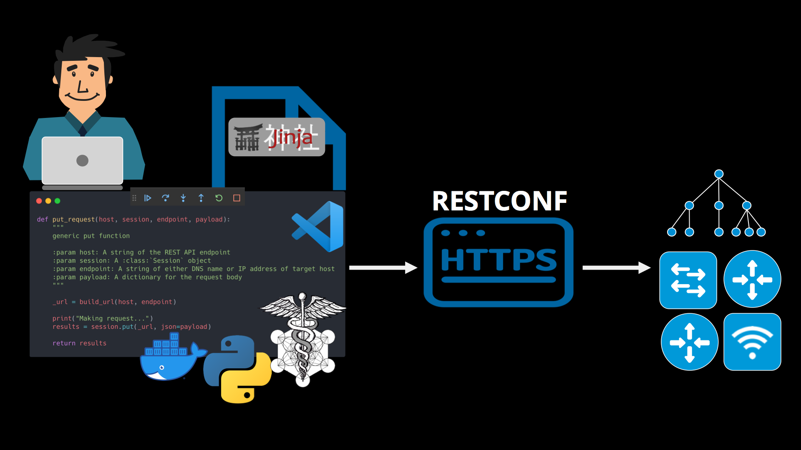
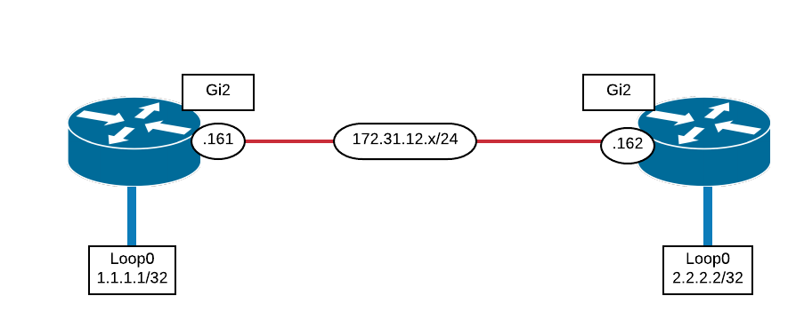
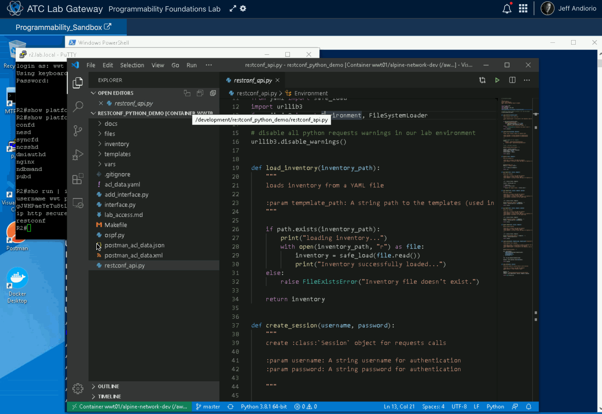

# RESTCONF with Python

Demonstration of utilizing the Python `requests` module to configure network devices using RESTCONF.

This repository is intended to be used in the [Programmability Foundations Lab](https://www.wwt.com/lab/programmability-foundations-lab) but you can modify the inventory and variables to work with any topology.

This lab uses several different yang models including:
- `ietf-interface.yang` model for configuration of the interfaces
- `Cisco-IOS-XE-ospf.yang` for configuration of the OSPF process
- `Cisco-IOS-XE-ospf-oper.yang` for validation of the OSPF configuration

## What Will You Learn

This walk through will provide you exposure to several critically import technologies and techniques used in model driven programmability.



You will be exposed to the following:

* Python `requests` library
* Concepts of Organizing your Code into functions for reuse
* RESTful APIs (in the context of RESTConf)
* Python pyyaml library for working with YAML encoded variable files
* Opening, reading, and writing to files.
* Jinja2 templates
* RESTful API interaction
* YANG models (standard and native)

## Prep Steps

While you can use any environment to run this demo, the path of least resistance is to use the [Programmability Foundations Lab](https://www.wwt.com/lab/programmability-foundations-lab).  This lab will have all of the necessary Python libraries, development tools and the network that matches the inventory file.

Follow these steps to utilize the [Programmability Foundations Lab](https://www.wwt.com/lab/programmability-foundations-lab):

1. Reserve the [Programmability Foundations Lab](https://www.wwt.com/lab/programmability-foundations-lab)

2. Connect to your newly launched lab

3. Run the **yang-explorer** container [optional]

   We will not be diving into the yang-explorer in any great depth but you could launch this to inspect the models.

    ```
    docker run --name yang-explorer -p 8088:8088 -d dmfigol/yang-explorer
    ```

4. Start development container
    ```shell
    docker container run -itv ~/development:/development wwt01/alpine-network-dev
    ```

5. Clone the repository (from within the container you launched)


   ```
   git clone https://github.wwt.com/andiorij/mdp_hands_on_demo.git
   ```

   **NOTE** The repository is also available [restconf_python_demo](https://github.com/jandiorio/restconf_python_demo.git) on github.com.


6. `cd' into the cloned repository

## Walk Through



Our goal is simple...add a loopback interface to each router, then configure OSPF between the two.

1. Review the existing router configs

   Q: Is there a loopback0 interface?

   Q: Is OSPF configured on the device?

2. Enabling RESTCONF

   Q: Is `restconf` enabled on the device?

   ```shell
   show run | inc restconf

   show platform softare yang-management process
   ```

   Q: Is `http secure-server` enabled on the device?

   ```shell
   show run | inc ip http secure-server
   ```

   Q: Is there a privilege 15 user created?

   ```shell
   show run | inc username
   ```

3. Clone the repository

> **NOTE:** Make sure you are in the development directory. Use `pwd` to see where you are.

In the wwt01/alpine-network-dev container terminal, clone the repository, https://github.com/jandiorio/restconf_python_demo.git


4. Visual Studio Code and Containers

If you followed the setup instructions, you should have already have launched the wwt01/alpine-network-dev docker container.  This container has all of the necessary automation components already installed.  We will use the Visual Studio Code container integration to connect our development environment container to our "integrated development environment".

It is not an absolute requirement to connect your container to the Visual Studio Code environment, but it will allow you to take advantage of a number of integrations making your development experience more pleasant.

STEP 1. Open Visual Studio Code

STEP 2. Click the >< symbol at the bottom and select **Remote-Container: Attach to running container**

STEP 3. Select the wwt01/alpine-network-dev container you launched in the earlier step

STEP 4. Open the folder of the cloned repository

STEP 5. Open a terminal window in VSC

The terminal you just opened puts you in the container terminal that you have attached to.  This means that when you run the script of even the python debugger it will be executing in the container not your local windows environment.  This is preferred... :)


## RESTConf and Python

RESTConf provides a RESTful API access to the YANG models supported on the device.  Since RESTConf is a RESTful API, you will use similar techniques to interact with it as you would any other RESTful API.

This lab will use the Python requests library, which is a very popular library for interacting with web services.

I have built a basic SDK to use when interacting with our network devices via RESTConf.

STEP 1. Open the `restconf_api.py` and review the functions available.

We will use this throughout for funcitons like load_inventory to load our inventory into memory (read from file), create_session to create a request.Session() object, and methods for supporting the CRUD methods (create, read, update, delete).

## Adding Interfaces Using YANG

In this section we will use the `ietf-interfaces.yang` model to create new loopback interfaces on the two routers in our simple topology.

STEP 1. Open the `add_interface.py` script

STEP 2. Create a debugging **breakpoint** in the script by to the left of the line number where you want to break.  We'll break right at the beginning so we can step through the script line-by-line.



> **NOTE:** There will be a red dot next to the line number where you set the breakpoint.

STEP 3. Execute the script in debug mode

STEP 4. Select the option "**Python File** Debug the currently active Python file"

STEP 5. Step into each line as your work through the file.

Take notice of the variables and values building in the left pane as your script executes and builds the related environment.

Continue to step through the file, stopping periodically to notice each major step and the surrounding details.


## Configure OSPF

This sections will use the same restconf_api.py for helper functions but this time focuses on the Cisco Native YANG models to configure OSPF.

The YANG models used include:
- Cisco-IOS-XE-Native-ospf.yang
- Cisco-IOS-XE-Native-ospf-oper.yang

We will configure and validate the results using RESTconf/YANG.

STEP 1. Open the `ospf.py` script

STEP 2. Set a debugging breakpoint

STEP 3. Start the executing in debug mode (same as before)

STEP 4. Walk, step-by-step through the script

This time you can use **step-over** to execute a function call without dropping into it line-by-line.  This makes sense since we have already seen the helper functions line-by-line in the last section.

## Wrap up

This repository accompanies the presentation and lead demonstration from the ENAUTO study group.

This lab walked you through using RESTConf and Python to automate networking devices using model drivel programmability.

The following concepts were employed and provided hands-on exposure:
- Python requests library
- Python pyyaml library for working with YAML encoded variable files
- Opening, reading, and writing to files.
- Jinja2 templates
- RESTful API interaction
- YANG models (standard and native)
